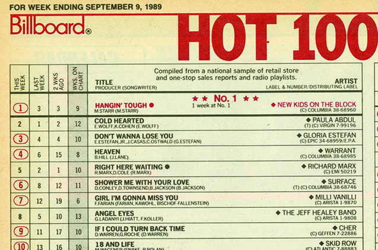

# Respuestas

## 1. Contexto
La recolección de la información se ha llevado a cabo para la asignatura de Tipología y ciclo de vida de los datos, y servirá como base para estudiar de forma práctica el proceso de captura del dato. Se trata de un listado de éxitos musicales semanales.
El sitio web escogido ([MusicChartsArchive](http://musicchartsarchive.com/)) contiene la información necesaria ya que ofrece listados situados temporalmente y categorizados. Para obtener la información se han aplicado técnicas de web scraping programadas en Python.

## 2. Título del dataset
Listas de éxitos de sencillos musicales a lo largo de las últimas 5 décadas.
## 3. Descripción

Se incluyen todos los títulos de los diferentes lanzamientos *sencillos* que se encontraron en lista de éxitos durante cada semana desde el año 1979. Cada lista semanal cuenta con 50 registros, los cuales incluyen título, artista, posición y semana a la cual pertenecen. 
## 4. Representación gráfica

*Muestra de una lista de la revista Billboard (año 1989)*

## 5. Contenido
A continuación se listan los diferentes campos que incluye el dataset.
 - **Position**: Valor numérico ordinal que representa la posición del título entre el total de esa semana. Ejemplo: 2. Rango = [0-50]
 - **Title**: Título de la canción. Ejemplo: "Song Title"
 - **Album Artist**: Intérprete de la canción. Ejemplo: "Artist"
 - **Artist**: Intérpretes y colaboradores intérpretes de la canción. Ejemplo: "Artist & Other Artist - Another One Remix". Este campo se creó para diferenciar el artista individual (Album Artist), que actúa como identificador único, del artista y posibles colaboradores del trabajo en concreto.
 - **Date**: Fecha que indica (el primer día de) la semana de la lista a la que pertenece el registro. Sirve para situarlas en el tiempo y agruparlas, ya que coincidirán los mismos títulos con diferente fecha y posición. El formato es americano (YYYY-MM-DD). Ejemplo: "1996-04-13"

En la tabla original de la que se han recogido cada uno de los elementos de la lista se encuentran los valores de position, title y artist. La fecha se ha extraído del título y de la página, y también figura en la URL. Para separar los campos Artist y Album Artist se ha tenido en cuenta si en el valor de la celda además del texto simple se diferencia otra etiqueta HTML que sirve de enlace a la página del artista. El enlace predomina sobre el resto del texto, y si solo hay uno de los dos tipos, se utiliza el mismo valor para ambos campos Album Artist y Artist.
Estos datos no varían en el tiempo, simplemente se generan nuevos registros cada semana.

## 6. Agradecimientos
Los datos pertenecen a una base de datos que contiene la web MusicChartsArchive y que, aunque no se ha podido encontrar referencia, se intuye que pueden fundamentarse en las listas de iTunes o Billboard.

## 7. Inspiración
Este conjunto de datos es interesante porque permite conocer y comparar la evolución de las tendencias musicales a lo largo de las últimas décadas. Con él se pueden responder a preguntas como:

 - ¿Qué géneros musicales triunfan más?
 - ¿Qué artistas se repiten más?
 - ¿Qué artista tiene más _números uno_?
 - Relación entre la época del año y el tipo de música en listas
 - Coincidencias o relaciones entre distintos artistas o géneros
## 8. Licencia
Debido a que no se ha encontrado especificación de licencia en el sitio web, se puede acceder de forma pública y gratuita y las páginas consultadas no son de impedido acceso según su robots.txt, se define la licencia **CC BY-NC-SA 4.0** como la más adecuada para el conjunto de datos extraído. No se considera de dominio público porque el autor no lo ha especificado así, aunque el uso que se le puede dar sí que es libre.

## 9. Código
El código fuente del programa que genera el dataset ha sido escrito en Python y se encuentra disponible en el repositorio accesible a través de [este enlace](https://github.com/serrulla/m2851-practica1/tree/master/src).

## 10. Dataset
El conjunto de datos extraído se encuentra en formato CSV, también accesible en el [repositorio](https://github.com/serrulla/m2851-practica1/tree/master/csv).
